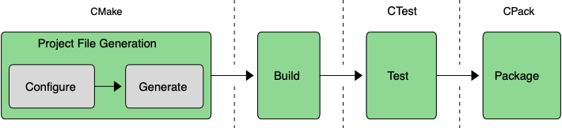

# 📖 Chapter 1: Introduction

CMake is a suite of tools designed to simplify the complex software development process, especially for multi-platform projects. It manages the entire build process from setup to packaging, supporting various platforms, tools, and languages.

### The CMake workflow

### Components

- **CMake:** Generates platform-specific project files
- **CTest:** Manages testing
- **CPack:** Handles packaging

CMake abstracts platform differences, making cross-platform development more manageable. It's recommended to use a recent CMake version, which can be installed alongside existing system installations.

> **Remark:** I've found these are the best ways to install CMake on different platforms:
>
> - **Linux:** Use the package manager for your distribution.
> - **macOS:** Use [Homebrew](https://brew.sh/): `brew install cmake`
> - **Windows:** Use [WinGet](https://learn.microsoft.com/en-us/windows/package-manager/winget/): `winget install --id=Kitware.CMake --exact`

Resources include official CMake documentation and the CMake forum for community support.

# 🎯 Workshop

Nothing to build in this chapter. The focus is on understanding CMake's role in the software development process.
