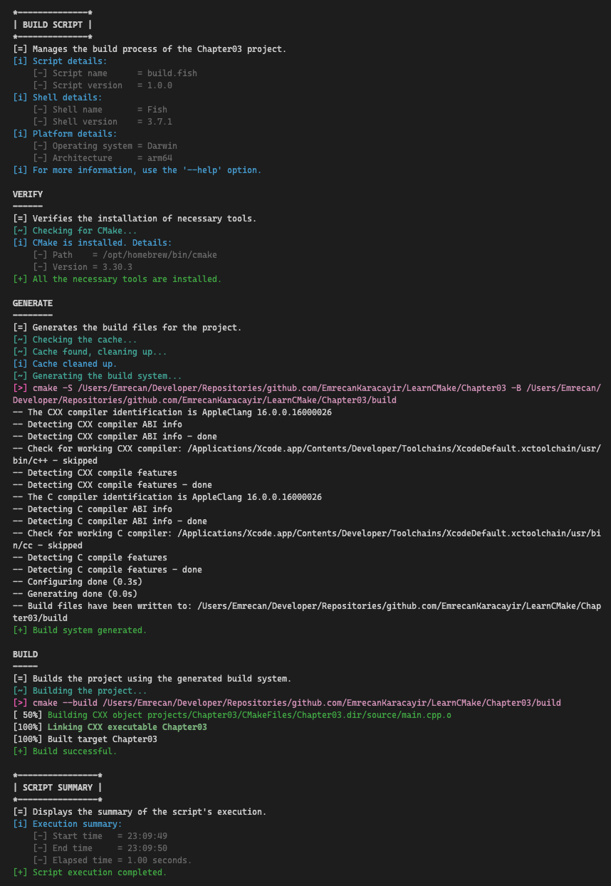
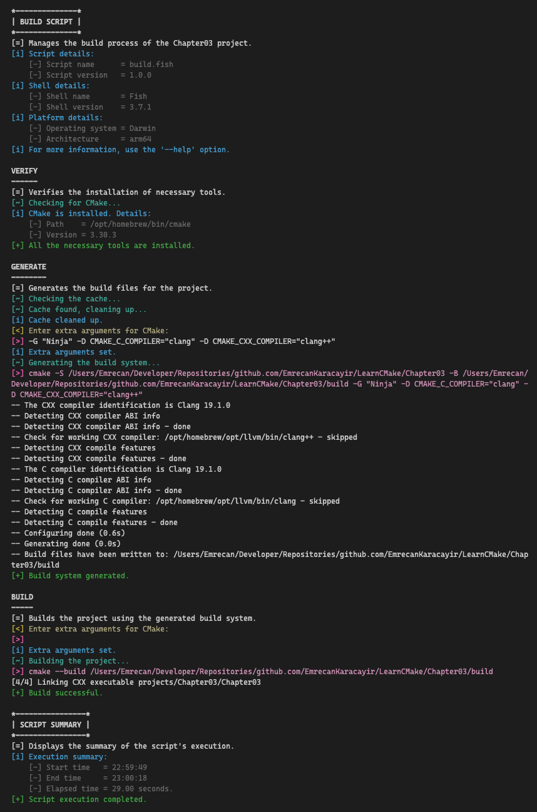

# 📖 Chapter 2: Setting Up A Project

CMake uses `CMakeLists.txt` as the primary configuration file to define project structure, build processes, tests, and packaging. This human-readable file serves as a platform-independent description of the entire project, which CMake then translates into platform-specific build tool project files.

**CMake operates with two key directories:**

- **Source directory:** Contains `CMakeLists.txt`, source files, and other files needed for the build. Typically under version control.
- **Binary (build) directory:** Houses all build outputs including executables, libraries, test results, and packages. Also contains `CMakeCache.txt` for storing configuration information.

### Two build approaches

1. **In-source builds:**

   - Source and build directories are the same
   - Discouraged due to file clutter and potential conflicts
   - Makes version control and clean-up more challenging

2. **Out-of-source builds:**

   - Separate source and build directories
   - Recommended for cleaner project organization
   - Allows multiple build configurations (e.g., Debug, Release) for the same source

### Generating project files

```sh
cmake -G "Ninja" -B build
```

- `-G`: Specifies generator (e.g., "Unix Makefiles", "Ninja", "Visual Studio 16 2019", "Xcode")
- `-B`: Defines build directory
- If `-G` is omitted, CMake chooses a default generator based on the platform

**CMake process involves three steps:**

1. **Configure:** Reads `CMakeLists.txt` and builds internal project representation
2. **Generate:** Creates project files based on the chosen generator
3. **Build:** Compiles source files, links binaries, and creates executables

**Generators fall into two categories:**

- **Multi-config generators (e.g., Visual Studio, Xcode):** Support multiple build configurations without re-running CMake
- **Single-config generators (e.g., Unix Makefiles, Ninja):** Require re-running CMake to switch configurations

### Running the build

```sh
cmake --build /path/to/build --config Debug --target MyApp
```

- `--build`: Specifies the build directory
- `--config`: Sets the build configuration (for multi-config generators)
- `--target`: Defines the target to build (optional, builds default target if omitted)

### Recommended practices

- Always use out-of-source builds to keep source and build files separate
- Create multiple build directories for different configurations or generators
- Regularly test with various generators to ensure cross-platform compatibility
- Prefer Ninja generator for its efficiency and broad platform support
- Use `cmake --build` in scripts for flexibility and easy switching between generator types
- Familiarize yourself with both command-line CMake usage and IDE integrations
  CMake simplifies cross-platform project setup and build management by providing:
- A unified approach to defining project structure and build processes
- Abstraction of platform-specific build tool differences
- Support for a wide range of compilers, IDEs, and build tools
- Capabilities for managing the entire build lifecycle, from configuration to packaging

By mastering CMake, developers can create more portable, maintainable, and flexible build systems, streamlining the development process across different platforms and toolchains.

# 🎯 Workshop

There is no workshop required for this chapter, but I recommend creating a build script to automate the build process.

### Objectives

- Verify the presence of necessary tools (CMake, Ninja, etc.)
- Create a build directory
- Generate build system files
- Build the project
- **Bonus:** Allow CMake command-line options to be passed through the script to customize the process

### Tips

You can create separate scripts for different platforms, or use a cross-platform scripting language like Python or PowerShell to handle variations. I've prepared two shell scripts as examples: `build.fish` for Linux/macOS and `build.ps1` for Windows.

Fish shell is used for Linux/macOS due to its concise syntax and powerful features, while PowerShell is chosen for Windows for its robust scripting capabilities.

#### Build script default behavior

The default behavior of the build script is to create a build directory, generate project files using the default generator, and build the project. The script checks for the presence of CMake before proceeding with the build process.



#### Build script with custom options

With the `--customize` flag, the build script allows custom CMake options to be passed through the command line. This feature enables developers to customize the build process by specifying additional CMake flags, such as build type, compiler, or other options.


