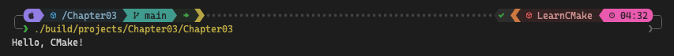

# 📖 Chapter 3: A Minimal Project

`CMakeLists.txt` is the foundation of every CMake project:

- Must be located at the top of the source tree
- Defines all aspects of the build process: sources, targets, testing, packaging, and custom tasks
- Can be as simple as a few lines or highly complex with multiple included files
- Uses CMake's own language, which includes familiar programming concepts:
  - Variables, functions, macros, conditional logic, looping, and comments

### Minimal `CMakeLists.txt` example

```cmake
cmake_minimum_required(VERSION 3.2)
project(MyApp)
add_executable(MyExe "main.cpp")
```

### CMake commands

- Similar to function calls in other languages
- Case-insensitive, but lowercase is the accepted convention
- Arguments are separated by spaces and can span multiple lines
- Don't return values directly, but can pass values back in other ways (covered in later chapters)

### Example of multi-line command

```cmake
add_executable(
  MyExe
  "main.cpp"
  "src1.cpp"
  "src2.cpp"
)
```

### Managing CMake versions

```cmake
cmake_minimum_required(VERSION major.minor[.patch[.tweak]])
```

- `cmake_minimum_required()` should always be the first command in CMakeLists.txt
- Specifies the minimum CMake version required and sets policy behavior
- Ensures project requirements are checked before proceeding
- CMake 3.26+ will warn if not called before project()
- Choose version carefully:
  - Consider project needs, target environments, and supported platforms
  - Version 3.5 is the absolute minimum for new projects
  - Recent versions may be needed for platforms like iOS with frequent updates

### The `project()` command

```cmake
project(projectName
  [VERSION major[.minor[.patch[.tweak]]]]
  [LANGUAGES languageName ...]
)
```

- Should follow immediately after `cmake_minimum_required()`
- Sets up project name, version, and enabled programming languages
- Project name restrictions: letters, numbers, underscores, and hyphens
- `VERSION` is optional but recommended (CMake 3.0+)
- `LANGUAGES` specifies programming languages to enable (C, CXX, Fortran, ASM, CUDA, etc.)
- If `LANGUAGES` is omitted, defaults to C and CXX
- Performs compiler checks for enabled languages
- Sets up variables and properties controlling the build for enabled languages

### Building a basic executable

```cmake
add_executable(targetName source1 [source2 ...])
```

- Use `add_executable()` command
- Creates an executable target with the specified source files
- Target name can contain letters, numbers, underscores, and hyphens
- Resulting executable name is platform-dependent:
  - **Windows:** MyApp.exe
  - **Unix-based systems:** MyApp
- Multiple executables can be defined in a single `CMakeLists.txt` file

> **Remark:** I am using `target_sources()` instead of `add_executable()` in the workshops for adding sources to targets.
>
> - It allows for more flexible source management
> - Can be used to add sources to any target type, not just executables
> - More consistent with modern CMake practices
> - Will be covered in detail in later chapters

### Commenting in CMake

```cmake
# Single-line comment
#[=[
  Multi-line comment
  Can span multiple lines
]=]
```

- **Single-line comments:** Use `#` at the beginning of a line or after a command
- **Block comments (CMake 3.0+):**
  - Start with `#[==[`
  - End with `]==]`
  - Number of `=` characters can vary, but must match at start and end
- Useful for temporarily commenting out blocks of code

### Example with comments

```cmake
cmake_minimum_required(VERSION 3.2)

# We don't use the C++ compiler, so don't let project()
# test for it in case the platform doesn't have one
project(MyApp VERSION 4.7.2 LANGUAGES C)

# Primary tool for this project
add_executable(
  MainTool
  "main.cpp"
  "debug.cpp" # Optimized away for release builds
)

# Helpful diagnostic tool for development and testing
add_executable(TestTool "testTool.cpp")

# These tools are not ready yet, disable them
#[=[
add_executable(NewTool1 "tool1.cpp")
add_executable(
  NewTool2
  "tool2.cpp"
  "extras.cpp"
)
]=]
```

### Recommended practices

- Always use `cmake_minimum_required()` as the first command in the top-level `CMakeLists.txt`
- Carefully consider the minimum required CMake version:
  - Balance between using newer features and supporting older environments
  - Consider the needs of projects that may depend on yours
- Include version information in the `project()` command
  - Helps with package metadata and version-related variables
  - Consider using Semantic Versioning or other popular versioning strategies
- Specify languages explicitly in the `project()` command if not using both C and C++
- Comment `CMakeLists.txt` files thoroughly, as you would with regular source code
- Use meaningful names for targets and be consistent with naming conventions

CMake provides a flexible and powerful way to define project structure and build processes. It supports a wide range of project types and complexities, from simple single-executable projects to complex multi-language systems with numerous dependencies and custom build steps. As projects grow, CMake's capabilities allow for modular organization, reusable components, and sophisticated build configurations.

# 🎯 Workshop

This workshop being the first one to introduce a real CMake project, so we need to establish the project layout first.

### The project layout

```plaintext
┌─📂 build
│  └─...
├─📂 cmake
│  └─📄 something.cmake
├─📂 docs
├─📂 projects
│  ├─📂 Project01
│  │  ├─📂 include
│  │  ├─📂 source
│  │  └─📄 CMakeLists.txt
│  └─📂 Project02
│     ├─📂 include
│     ├─📂 source
│     └─📄 CMakeLists.txt
├─📂 tests
│  ├─📂 Project01
│  │  └─📄 test.sh
│  └─📂 Project02
│     └─📄 test.sh
├─📂 tools
│  ├─📄 build.fish
│  └─📄 build.ps1
├─📄 .gitignore
├─📄 CHANGELOG.md
├─📄 CMakeLists.txt
├─📄 LICENSE.md
└─📄 README.md
```

This layout derived from common practices and recommendations with a one caveat: prior to working with CMake, I was using Visual Studio and I am accustomed to having a solution file that contains multiple projects. In my layout, each project is a separate entity, and the top-level `CMakeLists.txt` file is the equivalent of the solution file. The `CMakeLists.txt` file in each project directory is the equivalent of a project file in Visual Studio.

#### Project layout details

- `build/`: Directory for build output (ignored by Git)
- `cmake/`: Directory for CMake modules and scripts
- `docs/`: Directory for project documentation
- `projects/`: Directory for project source code
  - Each project has its own directory with `include/` and `source/` subdirectories
  - `CMakeLists.txt` in each project directory defines the project
- `tests/`: Directory for project tests
  - Each project has its own directory with test scripts
- `tools/`: Directory for complementary tools and scripts
  - `build.fish` and `build.ps1` scripts for building projects
- `.gitignore`: File to specify ignored files and directories for Git
- `CHANGELOG.md`: File to track project changes
- `CMakeLists.txt`: Top-level CMake file for the project
- `LICENSE.md`: File containing the project license
- `README.md`: Project overview and instructions

### Objectives

We are going to create a **"Hello CMake!"** project with only one source file to keep things straightforward. Our only target will be an executable. The source file will contain a simple `main()` function that prints "Hello, CMake!" to the console.

- Create the project layout as described
- Initialize the top-level `CMakeLists.txt` file
- Create a simple project in the `projects/` directory
- Define the project in the project's `CMakeLists.txt` file
- Include the project in the top-level `CMakeLists.txt` file via `add_subdirectory()`
- Build the project using the provided build scripts

#### Example output


### Tips

- Only create the required directories and files for this workshop
- Use `target_sources()` for the project source files instead of `add_executable()`
- Keep the coding simple and focused on the CMake aspects
- Use the provided build scripts if yours is not ready yet
  - `tools/build.fish` for Unix-based systems
    - Use `--help` for more information
  - `tools/build.ps1` for Windows systems
    - Use `-Help` for more information
- Verify the project builds successfully before moving on
- Use different generators and compilers to test cross-platform compatibility
  - `-G` option for specifying the generator
  - `-D CMAKE_<LANGUAGE>_COMPILER` for specifying the compiler for a language
- If you encounter issues, refer to the [CMake documentation](https://cmake.org/documentation/) or the provided solutions
