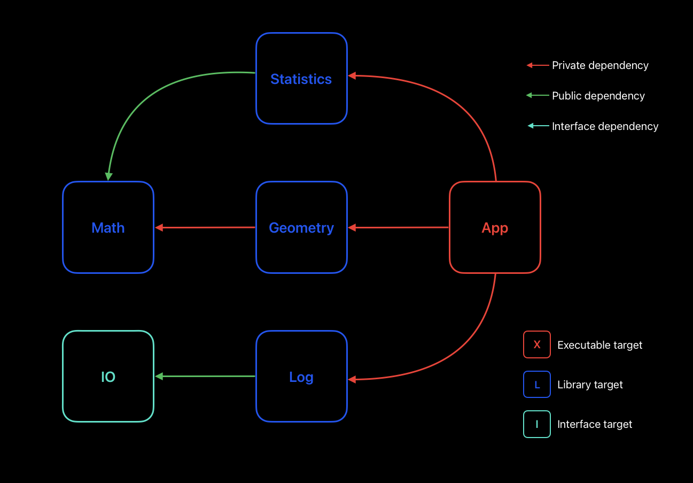
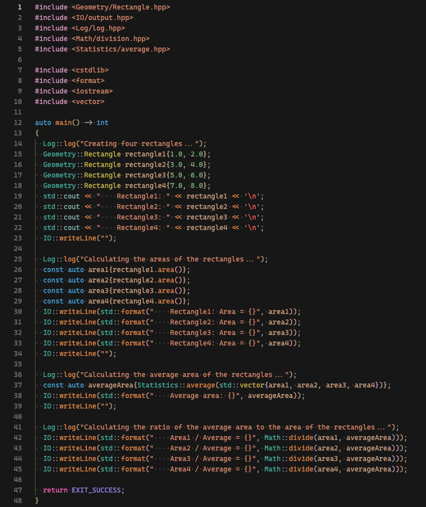
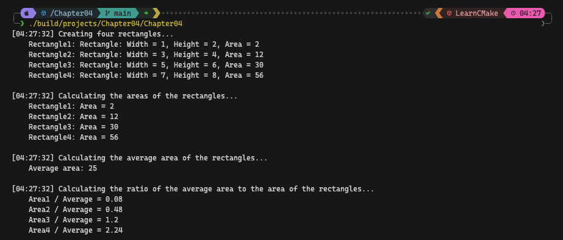

# 📖 Chapter 4: Building Simple Targets

This chapter covers the basics of building simple targets with CMake. You'll learn how to define executables and libraries, link them together, and set up dependencies between targets.

### Executables

Extended form of `add_executable()`:

```cmake
add_executable(
  TargetName [WIN32] [MACOSX_BUNDLE]
  [EXCLUDE_FROM_ALL]
  source1 [source2 ...]
)
```

**Additional options:**

- `WIN32`: Build as Windows GUI application (ignored on non-Windows platforms)
- `MACOSX_BUNDLE`: Build as app bundle on Apple platforms (ignored elsewhere)
- `EXCLUDE_FROM_ALL`: Exclude from default build target

**Example:**

```cmake
# Main GUI app, built by default
add_executable(MyApp WIN32 MACOSX_BUNDLE main.cpp widgets.cpp)

# Helper tools, not built by default
add_executable(checker checker.cpp EXCLUDE_FROM_ALL)
add_executable(reporter reporter.cpp EXCLUDE_FROM_ALL)
```

### Defining Libraries

Basic form of `add_library()`:

```cmake
add_library(
  TargetName [STATIC | SHARED | MODULE | INTERFACE]
  [EXCLUDE_FROM_ALL]
  [source1 [source2 ...]]
)
```

**Library types:**

- `STATIC`: Static library or archive
- `SHARED`: Shared or dynamically linked library
- `MODULE`: Dynamically loaded library (e.g., plugins)
- `INTERFACE`: Header-only library (no sources)

If type is omitted, it's determined by `BUILD_SHARED_LIBS` variable:

```cmake
set(BUILD_SHARED_LIBS TRUE)
```

Or via the command-line option:

```shell
cmake ... -D BUILD_SHARED_LIBS=TRUE
```

### Linking Targets

`target_link_libraries()` command:

```cmake
target_link_libraries(
  TargetName
  <PRIVATE|PUBLIC|INTERFACE> item1 [item2 ...]
  [<PRIVATE|PUBLIC|INTERFACE> item3 [item4 ...]]...
)
```

### Dependency types:

- `PRIVATE`: Internal implementation dependency
- `PUBLIC`: Both internal and interface dependency
- `INTERFACE`: Only interface dependency

> **Remark:** There is a very good explanation of the `PRIVATE`, `PUBLIC`, and `INTERFACE` dependencies.
>
> - `PRIVATE`: If your source files include the headers of library **X**, but your header files don't.
> - `PUBLIC`: If your both source and header files include the headers of library **Y**.
> - `INTERFACE`: If your header files include the headers of library **Z**, but your source files don't.

**Example:**

```cmake
add_library(Collector src1.cpp)
add_library(Algorithm src2.cpp)
add_library(Engine src3.cpp)
add_library(UI src4.cpp)
add_executable(MyApp main.cpp)

target_link_libraries(
  Collector
  PUBLIC UI
  PRIVATE Algorithm Engine
)
target_link_libraries(MyApp PRIVATE Collector)
```

### Linking Non-targets

`target_link_libraries()` can also link:

- Full path to a library file
- Plain library name (for system libraries)
- Link flags (starting with hyphen, except -l or -framework)

### Old-style CMake

Historical forms of `target_link_libraries()`:

- Without keywords (equivalent to `PUBLIC`)
- With `LINK_INTERFACE_LIBRARIES` (precursor to `INTERFACE`)
- With `LINK_PRIVATE` and `LINK_PUBLIC` keywords
  These forms are discouraged for new projects.

### Recommended practices

1. Choose target names based on functionality, not project name
2. Set project name directly, not via variables
3. Avoid prefixing library target names with "lib"
4. Omit `STATIC` or `SHARED` keywords unless necessary
5. Always use `PRIVATE`, `PUBLIC`, or `INTERFACE` in `target_link_librariea(`)
6. Prefer newer CMake features over old-style syntax

**Example of good practices:**

```cmake
project(MyProj)

add_library(CoreLib)
target_sources(CoreLib PRIVATE core.cpp)

add_executable(MyThing)
target_sources(MyThing PRIVATE main.cpp)

target_link_libraries(MyThing PRIVATE CoreLib)
```

These practices promote better project structure, flexibility, and clarity in defining dependencies between targets.

# 🎯 Workshop

This workshop focuses on multi-project CMake setup and different dependency types. It is best to create single executable and many libraries. We will use `add_subdirectory()` to include the projects to solution.

### Dependency graph



The graph shows the dependencies between the projects. The arrows indicate the direction of the dependencies.

There are different types of targets and dependencies:

- `App` is the main executable that depends on `Log`, `Geometry`, and `Statistics`. The dependencies are `PRIVATE` because they are internal to the `App`.
- `Log` is a library that depends on `IO`. The dependency is `PUBLIC` because `App` also needs `IO`.
- `Geometry` is a library that depends on `Math`. The dependency is `PRIVATE` because we need to demonstrate the `PRIVATE` dependency.
- `Statistics` is a library that depends on `Math`. The dependency is `PUBLIC` because we need to demonstrate the `PUBLIC` dependency.
- `Math` is a header-only library that doesn't have any dependencies. It is an `INTERFACE` library.

### Objectives

1. Create a similar multi-project CMake setup like the following structure:

```plaintext
┌─📂 build
│  └─...
├─📂 cmake
│  └─📄 language.cmake
├─📂 projects
│  ├─📂 App
│  │  ├─📂 source
│  │  │  └─📄 main.cpp
│  │  └─📄 CMakeLists.txt
│  ├─📂 Geometry
│  │  ├─📂 include
│  │  │  └─📂 Geometry
│  │  │     └─📄 Rectangle.hpp
│  │  ├─📂 source
│  │  │  └─📂 Geometry
│  │  │     └─📄 Rectangle.cpp
│  │  └─📄 CMakeLists.txt
│  ├─📂 IO
│  │  ├─📂 include
│  │  │  └─📂 IO
│  │  │     ├─📄 input.hpp
│  │  │     └─📄 output.hpp
│  │  └─📄 CMakeLists.txt
│  ├─📂 Log
│  │  ├─📂 include
│  │  │  └─📂 Log
│  │  │     └─📄 log.hpp
│  │  ├─📂 source
│  │  │  └─📂 Log
│  │  │     └─📄 log.cpp
│  │  └─📄 CMakeLists.txt
│  ├─📂 Math
│  │  ├─📂 include
│  │  │  └─📂 Math
│  │  │     ├─📄 addition.hpp
│  │  │     ├─📄 division.hpp
│  │  │     ├─📄 multiplication.hpp
│  │  │     └─📄 subtraction.hpp
│  │  ├─📂 source
│  │  │  └─📂 Math
│  │  │     ├─📄 addition.cpp
│  │  │     ├─📄 division.cpp
│  │  │     ├─📄 multiplication.cpp
│  │  │     └─📄 subtraction.cpp
│  │  └─📄 CMakeLists.txt
│  └─📂 Statistics
│     ├─📂 include
│     │  └─📂 Statistics
│     │     └─📄 average.hpp
│     ├─📂 source
│     │  └─📂 Statistics
│     │     └─📄 average.cpp
│     └─📄 CMakeLists.txt
├─📂 tools
│  ├─📄 build.fish
│  └─📄 build.ps1
└─📄 CMakeLists.txt
```

2. Define the projects in the project's `CMakeLists.txt` file.
3. Include the projects in the top-level `CMakeLists.txt` file via `add_subdirectory()`.
4. Link the targets with different dependency types.

#### Example C++ code



#### Example output



### Tips

- Use `add_subdirectory()` to include projects in the top-level `CMakeLists.txt`.
- Use `target_sources()` to add source files to the targets.
- Use `target_link_libraries()` to link the targets with the correct dependency types.
- Use `PRIVATE`, `PUBLIC`, or `INTERFACE` in `target_link_libraries()` to define the dependencies.
- Refer to **remark** for the explanation of `PRIVATE`, `PUBLIC`, and `INTERFACE` dependencies.
- If you encounter issues, refer to the [CMake documentation](https://cmake.org/documentation/) or the provided solutions
