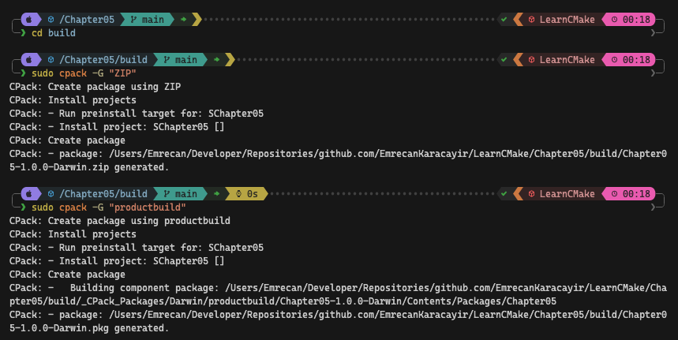

# 📖 Chapter 5: Basic Testing And Deployment

This is an overview of Chapter 5, covering the key concepts of testing, installing, and packaging in CMake. It includes examples and explanations of the various commands and best practices discussed in the chapter.

### Testing

CMake provides CTest for test scheduling and reporting.

**Basic setup:**

```cmake
enable_testing()
add_executable(testSomething testSomething.cpp)
add_test(NAME SomethingWorks COMMAND testSomething)
add_test(NAME ExternalTool COMMAND /path/to/tool someArg moreArg)
```

**Key points:**

- Use `enable_testing()` after `project()`
- `add_test()` defines test cases
- Test names should use basic characters (letters, numbers, hyphens, underscores)
- `COMMAND` can be an executable target or any shell command
- Default pass criteria: `exit code 0`

**Running tests:**

```shell
cmake -G "Ninja" -B "build" -D CMAKE_BUILD_TYPE="Debug"
cd build
cmake --build .
ctest
```

**For multi-configuration generators:**

```shell
ctest --build-config Debug
```
**Useful CTest options:**

- **`--parallel N`:** Run N tests in parallel
- **`--verbose`:** Show full output
- **`--output-on-failure`:** Show output only for failing tests

CMake also provides a test build target, but it's less flexible than running `ctest` directly.

### Installing

CMake's `install()` command manages deployment.

**Basic example:**

```cmake
add_executable(MyApp ...)
add_library(AlgoRuntime SHARED ...)
add_library(AlgoSDK STATIC ...)
install(TARGETS MyApp AlgoRuntime AlgoSDK)
```

**Key points:**

- CMake 3.14+ uses default install locations if not specified
- Earlier versions require explicit `DESTINATION` specifications
- Can install files and directories with `install(FILES ...)` and `install(DIRECTORY ...)`
- CMake 3.23+ introduces file sets for more convenient header installation

**Running an install:**

```shell
cmake -G Ninja -B build -D CMAKE_BUILD_TYPE=Debug
cd build
cmake --build .
cmake --install . --prefix /path/to/somewhere
```

**For multi-configuration generators:**

```shell
cmake --install . --config Debug --prefix /path/to/somewhere
```

CMake also provides an install build target, but it's less flexible than `cmake --install`.

### Packaging

CMake's CPack tool creates binary packages in various formats.

**Basic setup:**

```cmake
set(CPACK_PACKAGE_NAME MyProj)
set(CPACK_PACKAGE_VENDOR MyCompany)
set(CPACK_PACKAGE_DESCRIPTION_SUMMARY "An example project")
set(CPACK_PACKAGE_INSTALL_DIRECTORY ${CPACK_PACKAGE_NAME})
set(CPACK_VERBATIM_VARIABLES TRUE)
include(CPack)
```

**Creating packages:**

```shell
cmake -G Ninja -B build -D CMAKE_BUILD_TYPE=Release
cd build
cmake --build .
cpack -G "ZIP;WIX"
```

**For multi-configuration generators:**

```shell
cpack -G "ZIP;WIX" --config Release
```

CMake provides a package build target, but direct use of CPack is more flexible.

**Recommended Practices:**

1. Familiarize yourself with CTest and CPack command-line tools
2. Perform test installs to temporary staging areas
3. Avoid direct installs to permanent or system-wide locations
4. Use binary packages for installation when possible
5. For CMake 3.23+, use file sets for header management
6. When using the package build target, set `CPACK_GENERATOR` based on the platform:

**Example:**

```cmake
if(WIN32)
  set(CPACK_GENERATOR ZIP WIX)
elseif(APPLE)
  set(CPACK_GENERATOR TGZ productbuild)
elseif(CMAKE_SYSTEM_NAME STREQUAL "Linux")
  set(CPACK_GENERATOR TGZ RPM)
else()
  set(CPACK_GENERATOR TGZ)
endif()
```

These practices help streamline the testing, installation, and packaging processes, making project deployment more robust and flexible across different platforms and configurations.

# 🎯 Workshop

In this workshop we'll use the [Chapter 4's project](../Chapter04/README.md) and add testing and deployment features. The goal is to create passing and failing test, install the project, and create a binary package.

### Objectives

1. Create `tests` folder with sub-folders for each project.
2. Add one passing and one failing test for each target.
3. Create install rules for each target.
4. Integrate CPack to the project.
5. Use CTest to run the tests.
6. Use CPack to create several binary packages.

#### Example install process


#### Example test process


#### Example package process




### Tips

- Use `add_test()` to define test cases.
- Use `install()` to manage deployment.
- Use `set(CPACK...)` variables to configure CPack.
- Use `ctest` to run tests.
- Use `cpack` to create binary packages.
- `cpack` command only works in the build directory.
- Super user permissions may be required, use `sudo` or equivalent if needed.
- Inspect my solution for reference and guidance.
