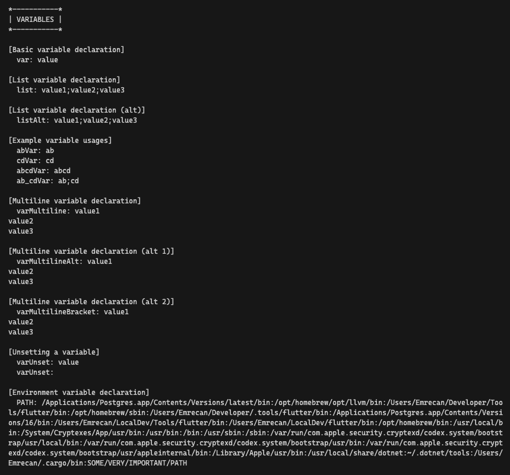
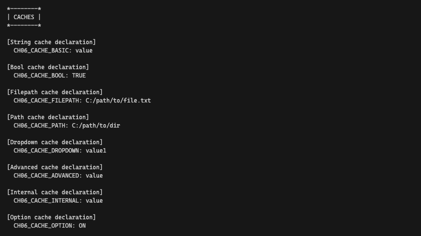
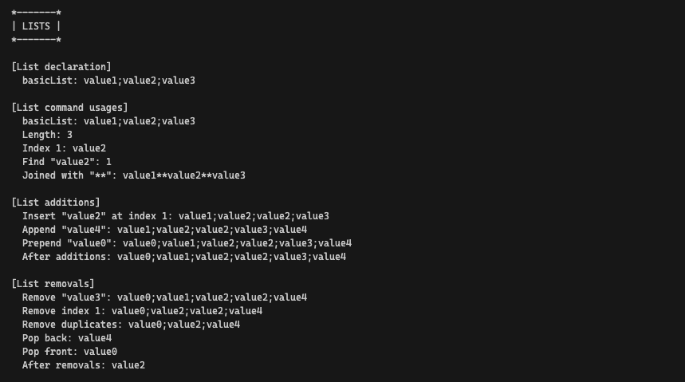

# 📖 Chapter 6: Variables

This is an overview of Chapter 6, covering the key concepts of variables in CMake. It includes examples and explanations of the various commands and best practices discussed in the chapter.

### Variable Basics

```cmake
set(varName value... [PARENT_SCOPE])
```

- Variables are fundamental in CMake
- Defined using `set()` command:
- **Variable names:** letters, numbers, underscores (case-sensitive)
- **Scope:** Limited to the file they're defined in (directory scope)
- All variables are strings in CMake
- Retrieving value: `${varName}`
- Undefined variables result in empty strings

**Examples:**

```cmake
set(myVar "a" "b" "c")  # myVar = "a;b;c"
set(myVar "a b c")  # myVar = "a b c"
set(foo "ab")
set(bar "${foo}cd")  # bar = "abcd"
```

### Environment Variables

- Accessed using `$ENV{VAR_NAME}`
- Set using `set(ENV{VAR_NAME} "value")`
- Changes only affect the current CMake instance

**Examples:**

```cmake
set(ENV{PATH} "$ENV{PATH}:/opt/myDir")
```

### Cache Variables

```cmake
set(varName value... CACHE type "docstring" [FORCE])
```

- Stored in `CMakeCache.txt`, persist between CMake runs
- Used for customization points
- Types: `BOOL`, `FILEPATH`, `PATH`, `STRING`, `INTERNAL`
- Normal variables take precedence over cache variables
- Command-line setting: `cmake -D myVar:type=someValue ..`.

#### `option()` command

```cmake
option(optVar helpString [initialValue])
```

- `option()` command for boolean cache variables:

### Scope Blocks (CMake 3.25+)

- Created using `block()` and `endblock()`
- Isolate variable changes
- `PARENT_SCOPE` keyword to modify enclosing scope
- `PROPAGATE` keyword to propagate changes back to enclosing scope

**Example:**

```cmake
set(x 1)
block(PROPAGATE x)
  set(x 2)
  set(y 3)
endblock()
# Here, x equals 2, y is undefined
```

### Printing Variable Values

- Use `message()` command

**Example:**

```cmake
set(myVar HiThere)
message("The value of myVar = ${myVar}")
```

### String Handling

- `string()` command for various operations
- Operations: `FIND`, `REPLACE`, `REGEX`, `SUBSTRING`, `LENGTH`, `TOLOWER`, `TOUPPER`, `STRIP`

**Examples:**

```cmake
string(FIND "abcdefabcdef" "def" fwdIndex)
string(REPLACE "def" "XXXXX" result "abcdefabcdef")
string(REGEX MATCH "[de]" matchOne "abcdefabcdef")
string(SUBSTRING "abcdefabcdef" 4 2 result1)
string(LENGTH "aBcDe" length)
```

### Lists

- Lists are strings with items separated by semicolons
- `list()` command for manipulation
- Operations: `LENGTH`, `GET`, `FIND`, `JOIN`, `INSERT`, `APPEND`, `PREPEND`, `REMOVE_ITEM`, `REMOVE_AT`, `REMOVE_DUPLICATES`, `POP_BACK`, `POP_FRONT`

**Examples:**

```cmake
set(myList "a" "b" "c")
list(LENGTH myList len)
list(GET myList 2 1 letters)
list(APPEND myList "d" "e" "f")
list(REMOVE_ITEM myList "b")
```

#### Problems With Unbalanced Square Brackets

- Semicolons between unmatched square brackets are not treated as list separators
- Can lead to unexpected list interpretations

### Math

```cmake
math(EXPR outVar mathExpr [OUTPUT_FORMAT format])
```

- `math()` command for basic mathematical operations
- Supports basic arithmetic operators and parentheses

**Example:**

```cmake
set(x 3)
set(y 7)
math(EXPR zDec "(${x}+${y}) * 2")
```

### Recommended Practices

1.  Use CMake GUI for easy project configuration
2.  Provide cache variables for optional build parts
3.  Avoid relying on environment variables
4.  Establish a consistent variable naming convention
5.  Avoid naming conflicts between cache and non-cache variables
6.  Familiarize yourself with CMake's predefined variables

# 🎯 Workshop

In this workshop, you will create a new project with a `CMakeLists.txt` file and demonstrate the usage of variables, caches, scopes, strings, lists, and math operations.

### Objectives

1. Create a new project with a `CMakeLists.txt` file.
2. Choose `NONE` as the project language.
3. Create `cmake` directory with following files:
   - `Variables.cmake`
   - `Caches.cmake`
   - `Scopes.cmake`
   - `Strings.cmake`
   - `Lists.cmake`
   - `Math.cmake`
4. Include the files in the `CMakeLists.txt` file.
5. In each file, demonstrate the usage of the respective CMake features.
6. Use `message()` to print the results.

#### Example output - Variables



#### Example output - Caches




#### Example output - Scopes


#### Example output - Strings


#### Example output - Lists



#### Example output - Math


### Tips

- Use `message()` to print variable values
- Use CMake GUI to view and modify cache variables
- Experiment with different variable types and operations
