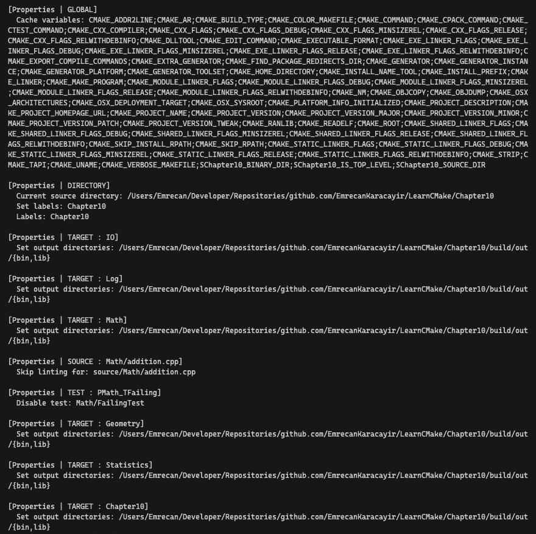

# 📖 Chapter 10: Properties

This is an overview of Chapter 10, covering the key concepts of properties in CMake. It includes various commands and best practices for working with properties in CMake.

### Introduction to Properties

Properties are a fundamental concept in CMake that allow you to attach metadata to various entities in your project. They can affect different aspects of the build process, such as compilation flags, binary locations, and other settings.

- Properties are attached to specific entities (directories, targets, source files, etc.)
- Differ from variables, which are not entity-specific
- Affect various aspects of the build process

### General Property Commands

CMake provides several commands for working with properties, including setting, getting, and defining properties. These commands allow you to manipulate properties at different levels of the project hierarchy.

#### `set_property()`

```cmake
set_property(entitySpecific
  [APPEND | APPEND_STRING]
  PROPERTY propertyName values...
)
```

- Assigns values to a property
- Can append values to existing properties
- **Entity types:** `GLOBAL`, `DIRECTORY`, `TARGET`, `SOURCE`, `INSTALL`, `TEST`, `CACHE`

#### `get_property()`

```cmake
get_property(resultVar entitySpecific
  PROPERTY propertyName
  [DEFINED | SET | BRIEF_DOCS | FULL_DOCS]
)
```

- Retrieves the value of a property
- Can be used to query properties at different levels
- **Entity types:** `GLOBAL`, `DIRECTORY`, `TARGET`, `SOURCE`, `INSTALL`, `TEST`, `CACHE`
- **Property types:** `DEFINED`, `SET`, `BRIEF_DOCS`, `FULL_DOCS`

#### `define_property()`

```cmake
define_property(entityType
  PROPERTY propertyName
  [INHERITED]
  [BRIEF_DOCS briefDoc [moreBriefDocs...]]
  [FULL_DOCS fullDoc [moreFullDocs...]]
  [INITIALIZE_FROM_VARIABLE variableName]
)
```

- Defines a new property with optional documentation and initialization
- **Entity types:** `GLOBAL`, `DIRECTORY`, `TARGET`, `SOURCE`, `INSTALL`, `TEST`, `CACHE`
- **Property types:** `INHERITED`, `BRIEF_DOCS`, `FULL_DOCS`, `INITIALIZE_FROM_VARIABLE`

### Global Properties

- Affect the overall build and configuration

#### Specific Commands

```cmake
get_cmake_property(resultVar propertyName)
```

### Directory Properties

- Sit between global and target properties
- Set defaults for target properties
- Override global properties for current directory

#### Specific Commands

```cmake
set_directory_properties(
  PROPERTIES
    prop1 val1
    [prop2 val2]
    ...
)
get_directory_property(resultVar [DIRECTORY dir] property)
```

### Target Properties

- Strong influence on how targets are built
- Control compilation flags, binary locations, etc.
- There are many target-specific property commands

#### Specific Commands

```cmake
set_target_properties(
  <targets> ...
  PROPERTIES
    <prop1> <value1>
    [<prop2> <value2>]
    ...
)
get_target_property(resultVar target propertyName)

target_compile_definitions(...)
target_compile_features(...)
target_compile_options(...)
target_include_directories(...)
target_link_directories(...)
target_link_libraries(...)
target_link_options(...)
target_precompile_headers(...)
target_sources(...)
```

### Source Properties

- Allow fine-grained control over individual source files
- Can affect compiler flags, tool options, etc.

#### Specific Commands

```cmake
set_source_files_properties(
  <files> ...
  [DIRECTORY <dirs> ...]
  [TARGET_DIRECTORY <targets> ...]
  PROPERTIES
    <prop1> <value1>
    [<prop2> <value2>]
    ...
)
get_source_file_property(
  <variable>
  <file>
  [DIRECTORY <dir> | TARGET_DIRECTORY <target>]
  <property>
)
```

### Cache Variable Properties

- Mainly affect CMake GUI and ccmake tool behavior
- Properties: `TYPE`, `ADVANCED`, `HELPSTRING`, `STRINGS`

### Test Properties

- Control test execution and behavior
- Properties: `LABELS`, `TIMEOUT`, `WORKING_DIRECTORY`, etc.

#### Specific Commands

```cmake
set_tests_properties(
  <tests> ...
  [DIRECTORY dir]
  PROPERTIES
    prop1 val1
    [prop2 val2]
    ...
)
get_test_property(test propertyName [DIRECTORY dir] resultVar)
```

### Installed File Properties

- Specific to packaging types
- Not commonly used in most projects

### Recommended Practices

1.  Use `set_property()` for flexibility and `APPEND` functionality
2.  Property-specific setters may be more convenient for multiple properties
3.  Prefer `target_...()` commands over direct property manipulation for targets
4.  Be cautious with source properties due to potential build performance impacts
5.  Consider alternatives to source properties where possible
6.  Use `INITIALIZE_FROM_VARIABLE` (CMake 3.23+) for custom property default values
7.  Be aware of the `INHERITED` behavior for property lookups
8.  Understand the differences between property types and their specific commands
9.  Use cache variable properties to improve CMake GUI and ccmake user experience
10. Be mindful of the limitations of certain generators (e.g., Xcode) with source properties

# 🎯 Workshop

In this workshop, you will practice working with properties in CMake. You will define, set, and retrieve properties at different levels of the project hierarchy.

### Objectives

- Define and set properties at the global, directory, and target levels
- Retrieve and query properties using `get_property()` and `get_target_property()`
- Explore the use of properties in controlling compilation flags, binary locations, etc.

#### Example output



### Tips

- Look up [this reference](https://cmake.org/cmake/help/latest/manual/cmake-properties.7.html) for more details on what properties are available for different entities.
- Use the `set_property()` and specific property commands to manipulate properties.
- Use the `get_property()` and specific property commands to retrieve property values.
- Experiment with different property values to see how they affect the build process.
- Pay attention to the scope of properties and how they cascade down the project hierarchy.
