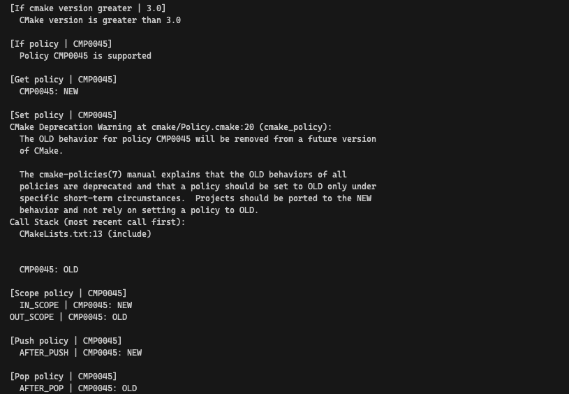

# 📖 Chapter 13: Policies

This is an overview of Chapter 13, covering the key concepts of CMake policies. It includes details on policy control, version ranges, individual policy control, checking policy availability, getting policy state, policy scope, recommended practices, and common use cases.

### Introduction to CMake Policies

- Policies control behavior changes between CMake versions
- Ensure backward compatibility while allowing improvements
- Provide controlled migration path for projects

### Policy Control

In CMake there are two main functions for policy control.

#### `cmake_minimum_required()`

```cmake
cmake_minimum_required(VERSION major[.minor[.patch[.tweak]]])
```

- Sets minimum CMake version and behavior

#### `cmake_policy()`

```cmake
cmake_policy(VERSION major[.minor[.patch[.tweak]]])
```

- Changes CMake behavior to match specified version

#### Version Ranges (CMake 3.12+)

```cmake
cmake_minimum_required(VERSION 3.7...3.12)
cmake_policy(VERSION 3.7...3.12)
```

- Specify minimum version and maximum supported policy version

#### Individual Policy Control

```cmake
cmake_policy(SET CMPxxxx NEW)
cmake_policy(SET CMPxxxx OLD)
```

- Control specific policies

#### Checking Policy Availability

```cmake
if(POLICY CMP0055)
  cmake_policy(SET CMP0055 NEW)
endif()
```

#### Getting Policy State

```cmake
cmake_policy(GET CMPxxxx outVar)
```

### Policy Scope

In CMake there are three main ways to control policy scope.

#### Using `block()` (CMake 3.25+)

```cmake
block(SCOPE_FOR POLICIES)
  # Policy changes here
endblock()
```

#### Using `cmake_policy()` Push/Pop

```cmake
cmake_policy(PUSH)
  # Policy changes here
cmake_policy(POP)
```

#### Implicit Policy Scopes

- `add_subdirectory()`, `include()`, and `find_package()` create implicit policy scopes
- `NO_POLICY_SCOPE` option available for `include()` and `find_package()`

### Recommended Practices

1. Prefer version-level policy control over individual policy manipulation
2. Use `cmake_policy(VERSION)` instead of `cmake_minimum_required(VERSION)` except at project start
3. Check policy availability with `if(POLICY ...)` rather than version checks
4. Use `block(SCOPE_FOR POLICIES)` (CMake 3.25+) or `cmake_policy(PUSH/POP)` for local policy changes
5. Be cautious with policy changes in functions
6. Avoid `NO_POLICY_SCOPE` option in `include()` and `find_package()`
7. Use `CMAKE_POLICY_DEFAULT_CMPxxxx` and `CMAKE_POLICY_WARNING_CMPxxxx` as a last resort

### Common Use Cases

1. Setting minimum CMake version and policy behavior:
   ```cmake
   cmake_minimum_required(VERSION 3.12)
   ```
2. Enabling newer behavior for specific policies:
   ```cmake
   if(POLICY CMP0074)
     cmake_policy(SET CMP0074 NEW)
   endif()
   ```
3. Temporarily changing policy behavior:
   ```cmake
   block(SCOPE_FOR POLICIES)
     cmake_policy(SET CMP0054 OLD)
     # Code relying on old behavior
   endblock()
   ```
4. Handling policy warnings:
   ```cmake
   if(POLICY CMP0069)
     cmake_policy(SET CMP0069 NEW)
   else()
     set(CMAKE_POLICY_WARNING_CMP0069 OFF)
   endif()
   ```
5. Setting policy defaults for developers:
   ```shell
   cmake -DCMAKE_POLICY_DEFAULT_CMP0077=NEW ...
   ```

# 🎯 Workshop

In this workshop, you're required to use CMake policies to control behavior changes in a CMake project.

### Objectives

- Set minimum CMake version and policy behavior
- Control specific policies
- Check policy availability
- Temporarily change policy behavior

#### Example Output



### Tips

- Use `cmake_minimum_required()` to set minimum CMake version
- Use `cmake_policy(SET ...)` to control specific policies
- Use `if(POLICY ...)` to check policy availability
- Use `block(SCOPE_FOR POLICIES)` and `cmake_policy(PUSH/POP)` for local policy changes
- Use `cmake_policy(GET ...)` to get policy state
