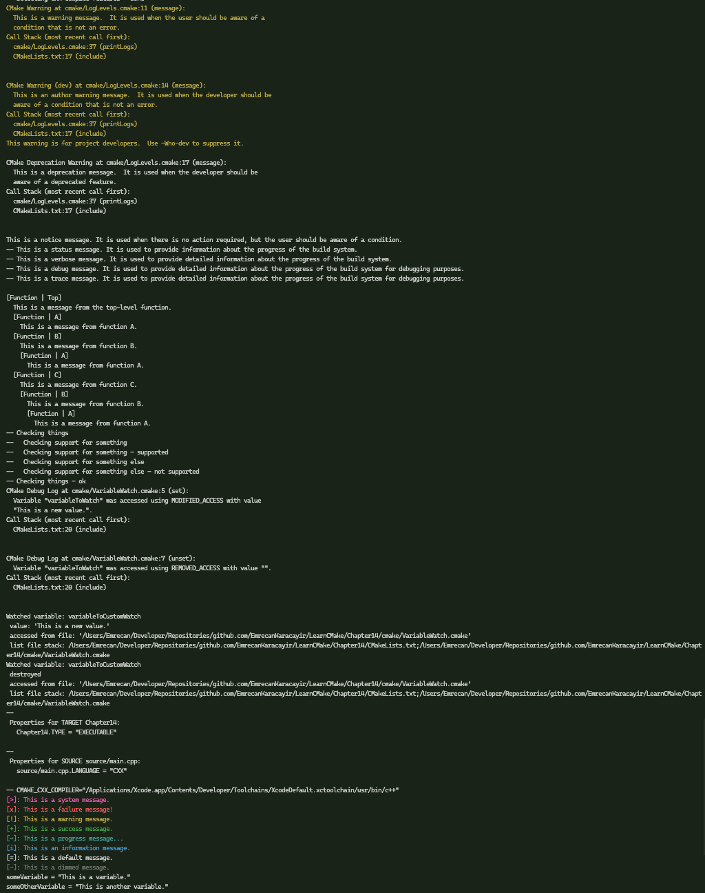

# 📖 Chapter 14: Debugging And Diagnostics

This is an overview of Chapter 14, covering the key concepts of debugging and diagnostics in CMake. It includes details on message command, print helpers, variable watch, profiling, and debugging tips.

## Log Messages

### Basic message command:

```cmake
message([mode] msg1 [msg2]...)
```

### Log Levels (in order of importance):

1. FATAL_ERROR: Stops processing immediately
2. SEND_ERROR: Continues configure, skips generation
3. WARNING: Shows warning, continues processing
4. AUTHOR_WARNING: Developer warnings (can be disabled with -Wno-dev)
5. DEPRECATION: Special category for deprecation messages
6. NOTICE: Default level (CMake 3.15+)
7. STATUS: Concise status information
8. VERBOSE: Detailed information (CMake 3.15+)
9. DEBUG: Developer-focused details (CMake 3.15+)
10. TRACE: Very low-level details (CMake 3.15+)

### Log Level Control:

```shell
cmake --log-level=VERBOSE ...
```

### Message Indentation (CMake 3.16+)

**Using `CMAKE_MESSAGE_INDENT`:**

```cmake
list(APPEND CMAKE_MESSAGE_INDENT "  ")
message("Indented message")
list(POP_BACK CMAKE_MESSAGE_INDENT)
```

### Message Contexts (CMake 3.17+)

**Using `CMAKE_MESSAGE_CONTEXT`:**

```cmake
list(APPEND CMAKE_MESSAGE_CONTEXT "MyProject")
message("Contextualized message")
```

**Enable context display:**

```shell
cmake --log-context ...
```

### Check Messages (CMake 3.17+)

**Three states:**

```cmake
message(CHECK_START "Starting check...")
message(CHECK_PASS "check passed")
message(CHECK_FAIL "check failed")
```

### Color Diagnostics (CMake 3.24+)

**Control with `CMAKE_COLOR_DIAGNOSTICS`:**

```cmake
set(CMAKE_COLOR_DIAGNOSTICS ON)
```

### Print Helpers

**Using the module `CMakePrintHelpers`:**

```cmake
include(CMakePrintHelpers)

cmake_print_properties(
  TARGETS target1 [target2...]
  PROPERTIES prop1 [prop2...]
)

cmake_print_variables(var1 [var2...])
```

### Variable Watching

**Using `cmake_variable_watch`:**

```cmake
variable_watch(myVar [command])
```

### Debugging Generator Expressions

**Two main approaches:**

1. Using `file(GENERATE)`:

   ```cmake
   file(GENERATE OUTPUT debug.txt CONTENT "${genex}\n")
   ```

2. Using custom target:

   ```cmake
   add_custom_target(debug_genex
     COMMAND ${CMAKE_COMMAND} -E echo "${genex}"
   )
   ```

### Profiling CMake (CMake 3.18+)

**Enable profiling:**

```shell
cmake --profiling-format=google-trace --profiling-output=profile.json ...
```

### Cache Management

**Clear cache:**

- Delete `CMakeCache.txt` manually
- Use `--fresh` option (CMake 3.24+)
- Use GUI's "Delete Cache" option

### Interactive Debugging (CMake 3.27+)

- Supports Debug Adapter Protocol
- IDE integration for step-by-step debugging
- Variable and property inspection
- Breakpoint support
- Not supported in all IDEs

### Recommended Practices

1. Log Level Usage:
   - Use appropriate log levels for different types of messages
   - Minimize `STATUS` level output
   - Save detailed information for `VERBOSE` or lower levels
2. Message Context:
   - Always append to `CMAKE_MESSAGE_CONTEXT`
   - Use project name as initial context
   - Use contexts to organize hierarchical output
3. Indentation:
   - Use two spaces per indent level
   - Always append to `CMAKE_MESSAGE_INDENT`
   - Use indentation to show logical structure
4. Check Messages:
   - Use `CHECK_START/PASS/FAIL` for coherent check reporting
   - Combine with indentation for better readability
5. Debugging:
   - Use `CMakePrintHelpers` for temporary debugging
   - Profile slow configure stages
   - Clear cache when investigating unexpected behavior
   - Use generator expression debugging techniques when needed
6. General:
   - Keep output concise and meaningful
   - Use consistent formatting and structure
   - Consider backward compatibility when using newer features
   - Implement features that gracefully degrade with older CMake versions

# 🎯 Workshop

In this workshop, you're required to use logging and diagnostics features in CMake to improve the debugging experience of a CMake project. You will use message commands, print helpers, variable watching, and profiling to identify and resolve issues.

### Objectives

- Use message commands to display log messages
- Use message contexts, indentation, and log levels for better output
- Use check messages for coherent check reporting
- Use print helpers to display variable information
- Use print helpers to display target properties
- Use variable watching to track variable changes
- Use custom command for variable watching
- Use custom target for debugging generator expressions
- Examine the custom module `FnPrint` which provides colorized output and additional features
- Use profiling to identify slow configure stages

#### Example Output



### Tips

- Use `message` command with appropriate log levels
- Use `CMAKE_MESSAGE_CONTEXT` for contextualized messages
- Use `CMAKE_MESSAGE_INDENT` for indented messages
- Use `message(CHECK_...)` for coherent check reporting
- Use `cmake_print_variables` to display variable information
- Use `cmake_print_properties` to display target properties
- Use `variable_watch` to track variable changes
- Use `file(GENERATE)` or custom target for debugging generator expressions
- Use `CMAKE_COLOR_DIAGNOSTICS` for colorized output
- Use `--profiling-format` and `--profiling-output` for profiling
- Examine `FnPrint` module for additional features
- Use `--fresh` option to clear cache
- Use IDE support (if any) for interactive debugging
- Use consistent formatting and structure in log messages
