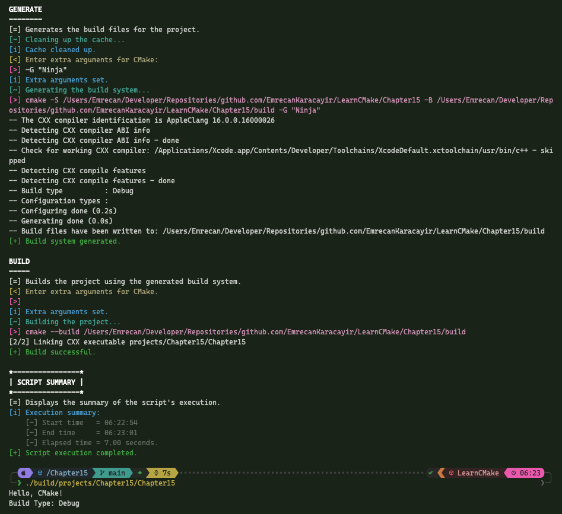
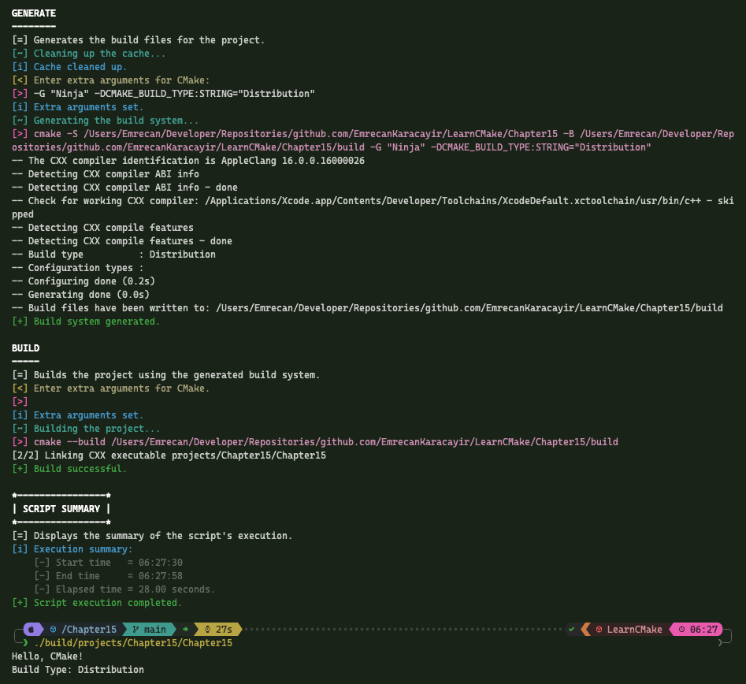
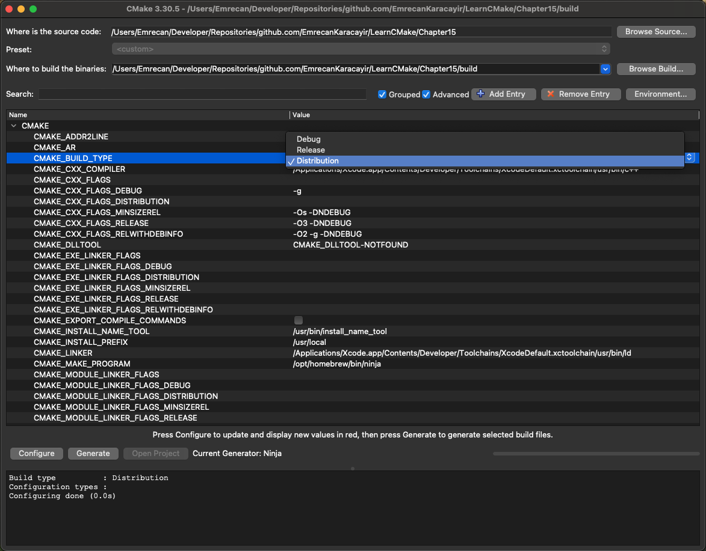
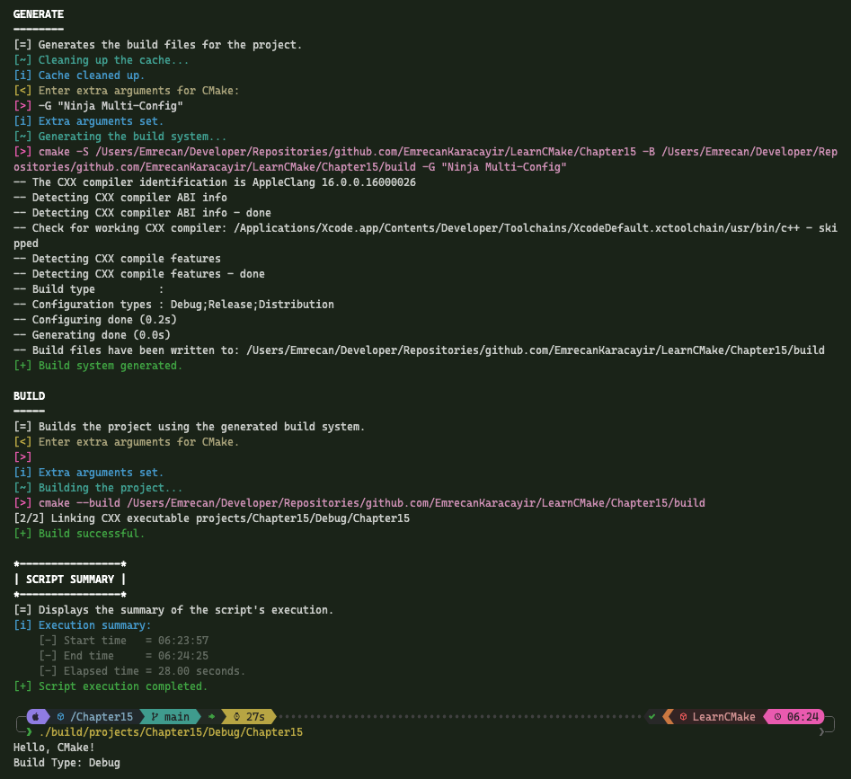
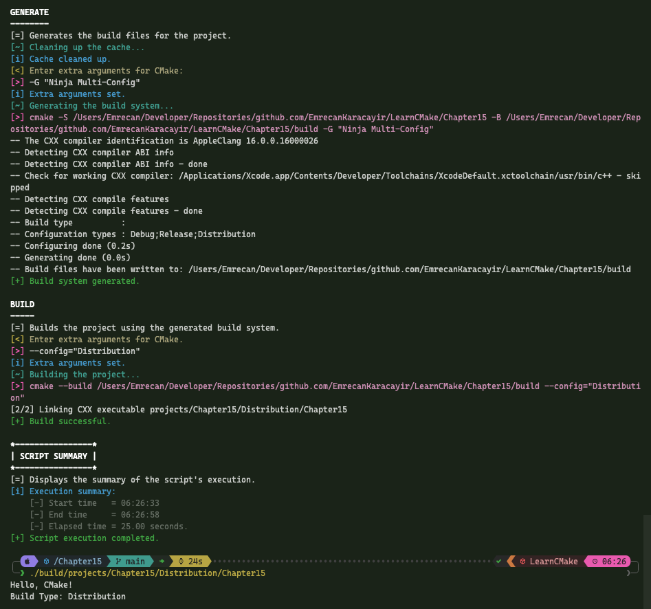

# 📖 Chapter 15: Build Types

This is an overview of Chapter 15, which covers the build types in CMake. It introduces the concept of build types and how they affect the build process. The multi-config generators are discussed, along with the single-config generators.

### Build Type Basics

#### Standard Build Types:

1. `Debug`

   - No optimizations
   - Full debug information
   - Fast build times
   - Best for development/debugging

2. `Release`

   - Full optimizations
   - No debug information
   - Best for production releases

3. `RelWithDebInfo`

   - Near-Release performance
   - Debug information included
   - Compromise between Debug and Release
   - Note: Assertions typically disabled

4. `MinSizeRel`
   - Optimized for size, not speed
   - No debug information
   - Typically for embedded systems

### Generator Types and Build Configuration

#### Single Configuration Generators (Makefiles, Ninja):

```shell
cmake -G Ninja -DCMAKE_BUILD_TYPE=Debug -B build
cmake --build build
```

**Multiple build directories approach:**

```plaintext
project/
├── src/
├── build-debug/
├── build-release/
└── build-relwithdebinfo/
```

#### Multi-Configuration Generators (Visual Studio, Xcode, Ninja Multi-Config):

```shell
cmake -G Xcode -B build
cmake --build build --config Debug
```

### Common Errors

#### Incorrect Build Type Check:

```cmake
if(CMAKE_BUILD_TYPE STREQUAL "Debug")
  add_compile_definitions(MYPROJ_DEBUG)
endif()
```

#### Correct Build Type Check:

```cmake
add_compile_definitions($<$<CONFIG:Debug>:MYPROJ_DEBUG>)
```

### Custom Build Types

#### For Multi-Configuration Generators:

```cmake
if(MYPROJ_IS_TOP_LEVEL)
  get_property(isMultiConfig GLOBAL PROPERTY GENERATOR_IS_MULTI_CONFIG)
  if(isMultiConfig)
    if(NOT "Profile" IN_LIST CMAKE_CONFIGURATION_TYPES)
      list(APPEND CMAKE_CONFIGURATION_TYPES Profile)
    endif()
  endif()
endif()
```

#### For Single-Configuration Generators:

```cmake
if(NOT isMultiConfig)
  set_property(CACHE CMAKE_BUILD_TYPE PROPERTY
    STRINGS "Debug" "Release" "Profile"
  )
endif()
```

### Setting Flags for Custom Build Type:

#### Direct approach

```cmake
set(CMAKE_CXX_FLAGS_PROFILE "-p -g -O2")
set(CMAKE_EXE_LINKER_FLAGS_PROFILE "-p -g -O2")
```

#### Based on Existing Build Type:

```cmake
set(CMAKE_CXX_FLAGS_PROFILE "${CMAKE_CXX_FLAGS_RELWITHDEBINFO} -p")
set(CMAKE_EXE_LINKER_FLAGS_PROFILE "${CMAKE_EXE_LINKER_FLAGS_RELWITHDEBINFO} -p")
```

### Setting Build Type Postfix:

```cmake
set(CMAKE_PROFILE_POSTFIX _profile)
```

### Marking Debug Configurations:

```
set_property(GLOBAL APPEND PROPERTY
  DEBUG_CONFIGURATIONS StrictChecker
)
```

### Example Build Type Management:

Here we will:

1. Set the default build type to Debug
2. Add a FastDebug build type
3. Define CMake GUI dropdown options for build types
4. Remove MinSizeRel and RelWithDebInfo build types from multi-config generators
5. Add FastDebug to the list of configurations for multi-config generators
6. Set FastDebug flags to be the same as RelWithDebInfo
7. Add a `_fd` postfix for FastDebug libraries
8. Mark FastDebug as a debug configuration

```cmake
cmake_minimum_required(VERSION 3.30)

get_cmake_property(isMultiConfig GENERATOR_IS_MULTI_CONFIG)
if(NOT isMultiConfig)
  set(CMAKE_BUILD_TYPE "Debug" CACHE STRING "Build type")
endif()

project(SChapter15 VERSION 1.0.0 LANGUAGES CXX)

if (SChapter15_IS_TOP_LEVEL)
  if (NOT isMultiConfig)
    set_property(CACHE CMAKE_BUILD_TYPE PROPERTY STRINGS "Debug" "Release" "FastDebug")
  else()
    list(REMOVE_ITEM CMAKE_CONFIGURATION_TYPES "MinSizeRel")
    list(REMOVE_ITEM CMAKE_CONFIGURATION_TYPES "RelWithDebInfo")
    if (NOT "Debug" IN_LIST CMAKE_CONFIGURATION_TYPES)
      list(APPEND CMAKE_CONFIGURATION_TYPES "Debug")
    endif()
    if (NOT "Release" IN_LIST CMAKE_CONFIGURATION_TYPES)
      list(APPEND CMAKE_CONFIGURATION_TYPES "Release")
    endif()
    if (NOT "FastDebug" IN_LIST CMAKE_CONFIGURATION_TYPES)
      list(APPEND CMAKE_CONFIGURATION_TYPES "FastDebug")
    endif()
  endif()
endif()

set(CMAKE_C_FLAGS_FastDebug             "${CMAKE_C_FLAGS_RELWITHDEBINFO}")
set(CMAKE_CXX_FLAGS_FastDebug           "${CMAKE_CXX_FLAGS_RELWITHDEBINFO}")
set(CMAKE_EXE_LINKER_FLAGS_FastDebug    "${CMAKE_EXE_LINKER_FLAGS_RELWITHDEBINFO}")
set(CMAKE_SHARED_LINKER_FLAGS_FastDebug "${CMAKE_SHARED_LINKER_FLAGS_RELWITHDEBINFO}")
set(CMAKE_STATIC_LINKER_FLAGS_FastDebug "${CMAKE_STATIC_LINKER_FLAGS_RELWITHDEBINFO}")
set(CMAKE_MODULE_LINKER_FLAGS_FastDebug "${CMAKE_MODULE_LINKER_FLAGS_RELWITHDEBINFO}")

set(CMAKE_FastDebug_POSTFIX "_fd")

set_property(GLOBAL APPEND PROPERTY
  DEBUG_CONFIGURATIONS FastDebug
)
```

### Recommended Practices

1. **Generator Independence:**
   - Don't assume specific generator
   - Support multiple generator types
   - Use generator-agnostic approaches
2. **Single-Configuration Best Practices:**
   - Use multiple build directories
   - Set default `CMAKE_BUILD_TYPE` if empty
   - Verify generator type before using `CMAKE_BUILD_TYPE`
3. **Multi-Configuration Best Practices:**
   - Only modify `CMAKE_CONFIGURATION_TYPES` if multi-config
   - Modify regular variable, not cache variable
   - Only change in top-level `CMakeLists.txt`
4. **Generator Type Detection:**
   - Use `GENERATOR_IS_MULTI_CONFIG` property (CMake 3.9+)
   - Avoid relying on `CMAKE_CONFIGURATION_TYPES` existence
5. **File Locations:**
   - Avoid `LOCATION` target property
   - Use generator expressions (e.g., `$<TARGET_FILE:...>`)
   - Don't assume specific output directory structure
6. **Custom Build Types:**
   - Define all necessary flag variables
   - Consider using presets or toolchain files
   - Set appropriate postfixes for library naming
   - Mark debug configurations appropriately

# 🎯 Workshop

In this workshop, you're required to use build types in CMake to manage different build configurations for a project. You will define custom build types, set flags, postfixes, and debug configurations to enhance the build process.

### Objectives

- Define a default build type if the generator is not multi-config
- Decide on a custom build type
- Decide if on a top-level project
- Modify `CMAKE_BUILD_TYPE` cache variable's property to include build types if not multi-config
- Modify `CMAKE_CONFIGURATION_TYPES` list for multi-config generators (remove at least one build type)
- Set flags for the custom build type based on an existing build type
- Set a postfix for libraries built with the custom build type
- Don't forget to mark the custom build type as a debug configuration if it is one
- Use `$<CONFIG:...>` generator expression to conditionally add compile definitions

#### Example Single-Config Generator Default Build Type Output



#### Example Single-Config Generator Custom Build Type Output



#### Example CMake GUI Dropdown Options



#### Example Multi-Config Generator Default Build Type Output



#### Example Multi-Config Generator Custom Build Type Output



### Tips

- Use `GENERATOR_IS_MULTI_CONFIG` property to detect multi-config generators
- Use `CMAKE_CONFIGURATION_TYPES` list to modify build types for multi-config generators
- Use `CMAKE_BUILD_TYPE` cache variable to set the default build type
- Use `set_property()` to modify cache variable properties
- Use `$<CONFIG:...>` generator expression to conditionally set compile definitions
- Use `set(CMAKE_BUILD_TYPE ...)` to set the default build type
- Use `list(APPEND ...)` to add build types to the configuration list
- Use `set(CMAKE_<LANG>_FLAGS_... ...)` to set flags for the custom build type
- Use `set(CMAKE_<LANG>_POSTFIX ...)` to set a postfix for libraries
- Use `set_property(GLOBAL APPEND PROPERTY ...)` to mark debug configurations
